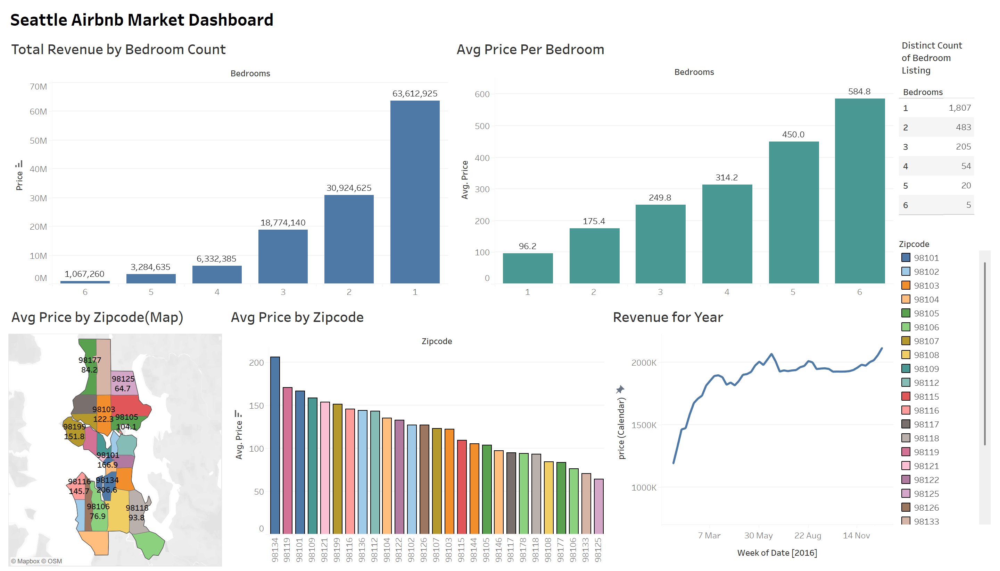

# Seattle Airbnb Market Dashboard

An interactive Tableau dashboard that visualizes open-source Airbnb data for Seattle. This project provides insights into listings by bedroom count, average prices by neighborhood, and revenue trends across different time periods.

## Table of Contents

- [Overview](#overview)
- [Dashboard Preview](#dashboard-preview)
- [Key Features](#key-features)
- [Published Dashboard](#published-dashboard)
- [Data Source](#data-source)
- [License](#license)

## Overview

The goal of this project is to analyze Airbnb listings in Seattle by examining factors like bedroom count, average pricing by zip code, and total revenue trends over time. Using Tableau’s interactive capabilities, this dashboard allows users to quickly spot patterns, compare various segments (such as neighborhoods or bedroom types), and gain deeper insights into the short-term rental market in Seattle.

## Dashboard Preview

## Key Features

- **Comprehensive Listings & Revenue Analysis:**  
  Gain insights through detailed visualizations that illustrate how revenue and listings change with various parameters, such as the number of bedrooms.

- **Detailed Geographical Insights:**  
  Explore market trends across Seattle with interactive maps and bar charts that highlight average pricing variations by zip code.

- **Enhanced Interactivity:**  
  Utilize dynamic filters and tooltips that empower users to dive into the data, uncover trends, and extract tailored insights.

## Published Dashboard

This dashboard is publicly accessible on Tableau Public:

**[Seattle Airbnb Market Dashboard on Tableau Public](https://public.tableau.com/views/AirbnbSeattleProject_17441197506480/Dashboard1?:language=en-US&publish=yes&:sid=&:redirect=auth&:display_count=n&:origin=viz_share_link)**

Feel free to view, interact, and share with others who might benefit from these insights. For the best experience, view the dashboard in full screen mode.

## Data Source

The data used in this project comes from the following Kaggle dataset:

**[Airbnb Listings Dataset](https://www.kaggle.com/datasets/alexanderfreberg/airbnb-listings-2016-dataset)**

Please refer to the dataset's page on Kaggle for more details and licensing information related to the data.

## License

This repository is licensed under the MIT License. See the [LICENSE](LICENSE) file for more details.
